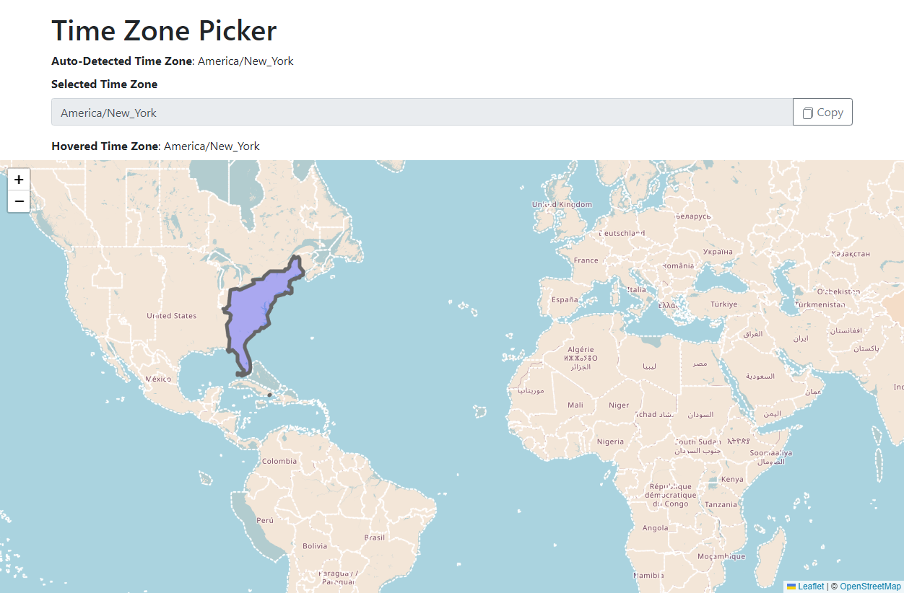

# Time Zone Picker

**Web app** - Find your time zone!

Visit the following link to find your time zone:

https://zones.arilyn.cc/

## References

Software/tools used to make this project:

-   [Timezone Boundary Builder](https://github.com/evansiroky/timezone-boundary-builder) by [evansiroky](https://github.com/evansiroky) - A tool to extract data from Open Street Map (OSM) to build the boundaries of the world's timezones.
-   [Mapshaper](https://github.com/mbloch/mapshaper) by [@mbloch](https://github.com/mbloch) - Tools for editing Shapefile, GeoJSON, TopoJSON and CSV files.
-   [Leaflet](https://github.com/Leaflet/Leaflet) by [Leaflet](https://github.com/Leaflet) - JavaScript library for mobile-friendly interactive maps.
-   [OpenStreetMap](https://www.openstreetmap.org/copyright) - A free, open geographic database updated and
    maintained by a community of volunteers via open collaboration.

Originally inspired by:

-   [timezone-picker](https://github.com/kevalbhatt/timezone-picker) by [kevalbhatt](https://github.com/kevalbhatt) - A JavaScript plugin to select time zones using a world map.
